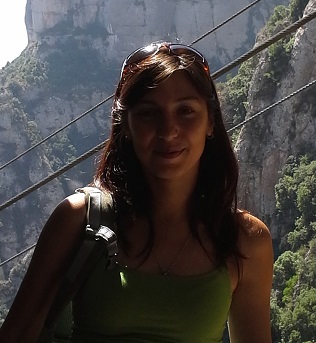
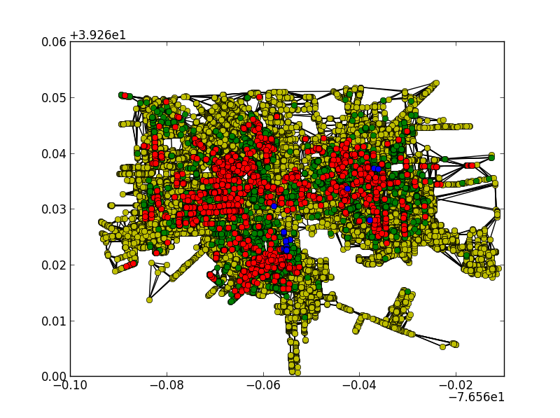
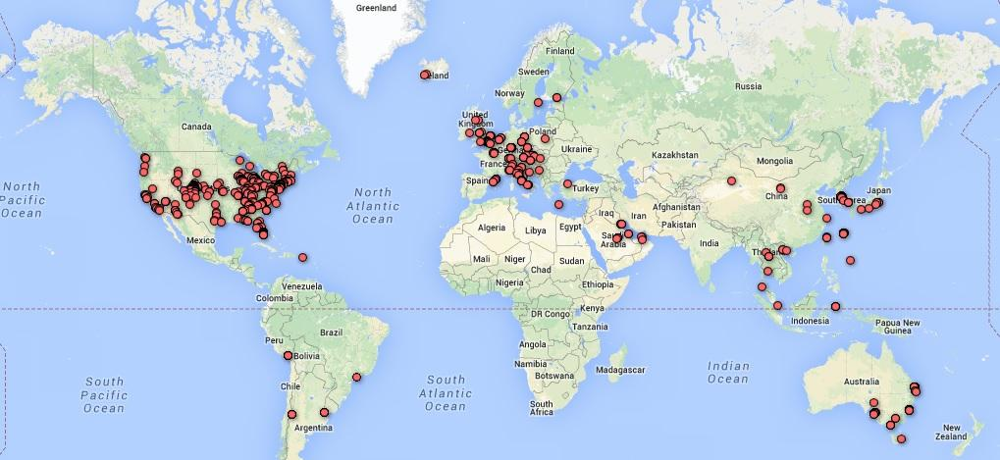
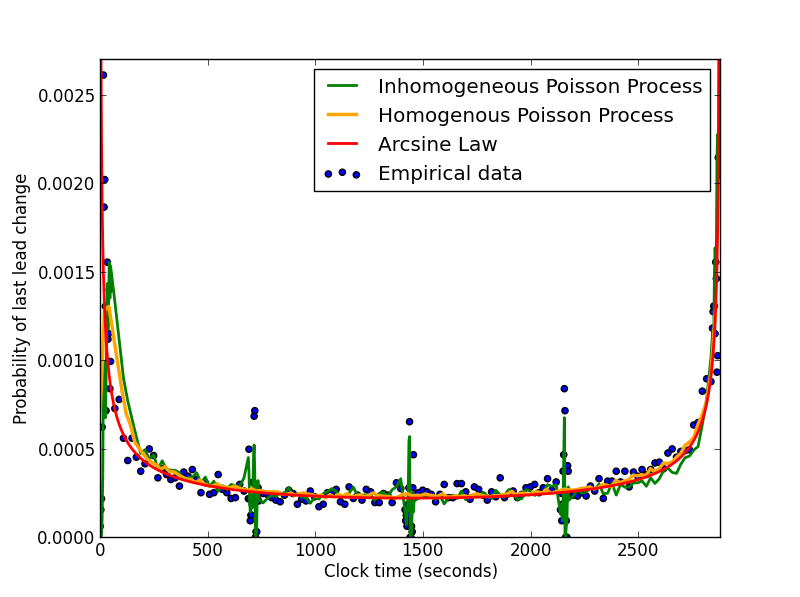

# Personal Information

## Name
Marina Kogan

## Email
marina.kogan@colorado.edu

## Photo

## Website

# Current Funding
Yes, RAship on CHIME NSF grant with Leysia Palen

# PhD Program

## Thesis Advisor
Leysia Palen

## Committee
* Leysia Palen

## Milestones

| Milestone            | Completed         | Planned           |         
| -------------------- | ----------------- | ----------------- |
| Start                | Fall 2012 |                   |
| Area Exam            |  | Spring 2015 |
| Proposal Defense     |  | Fall 2015 |
| Dissertation Defense |  | Spring 2017 |

## Courses

| Course           | Taken             | Planned            | Depth    | Breadth | 
| ---------------- | ----------------- | ------------------ | -------- | ------- |
| CSCI 7000  Inference, Models and Simulation for Complex Systems | Fall 2011 |  | yes | no|
| APPM 5560 Markov Processes| Fall 2012 | | yes| no|
| CSCI 7222 Probabilistic Models of Human and Machine Intelligence | Fall 2012 |  | yes | no|
| CSCI 6000 Introduction to CSCI PhD Program| Fall 2012 |  | no | no|
| CSCI 5454 Design and Analysis of Algorithms | Spring 2013 |  | no | yes |
| CSCI 5502 Data Mining | Spring 2013 |  | no | yes |
| CSCI 5832 Natural Language Processing | Fall 2013 |  | no | yes |
| CSCI 5919 HCI Survey and Synthesis | Fall 2013 |  | no | yes |
| CSCI 5622 Machine Learning | Spring 2014 |  | no | yes |
| CSCI 7900 Doctor's Level Independent Study | Spring 2014 |  | yes | no |
| CSCI 5352 Network Analysis and Modeling | Fall 2104 |  | yes | no |
| CSCI 7900 Doctor's Level Independent Study | Fall 2014 |  | yes | no |

# Research

## Publications

* Kogan, M., Palen L., and Anderson K. (To appear 2015). Tweet Local, Retweet Global: Retweeting by the Geographically-Vulnerable during Hurricane Sandy. To appear in CSCW 2015. [[Link]](https://www.cs.colorado.edu/~palen/palen_papers/CSCW-SandyRetweetPaperCR.pdf)
* Laursen, S.L., Hassi, M.-L., Kogan, M., Hunter, A.-B., & Weston, T. (2014). Benefits for Women and Men of Inquiry-based Learning in College Mathematics: A Multi-institution Study. Journal for Research in Mathematics Education.
* Kogan, M., & Laursen, S. L. (2013).  Assessing long-term effects of inquiry-based learning:  A case study from college mathematics.  Innovative Higher Education, 39(3).

## Presentations
* Finding the right information in disaster: assessing relevance and reliability of tweets from the Hurricane Sandy. Poster. CRA-W Graduate Cohort Workshop, 2014.
      
## Awards

* CRA-W Grad Cohort, 2014
* GK-12 NSF fellowship
* Research Community Development Award, 2012

# Teaching

* Sociology, AP Government - Boudler High School, ECSITE Fellow, 2013-2014
* Sociology, AP Government, Video Production - Boudler High School, ECSITE Fellow, 2012-2013

# Service

* Science Discovery Summer Class, 2014
* Science Discovery Summer Class, 2013

# Highlights

## Three-neasrest-neighbor racial network of Baltimore in 1880

## Spatial Distribution of Hurricane Sandy-related tweets

## Distributions of the last lead change time for NBA

